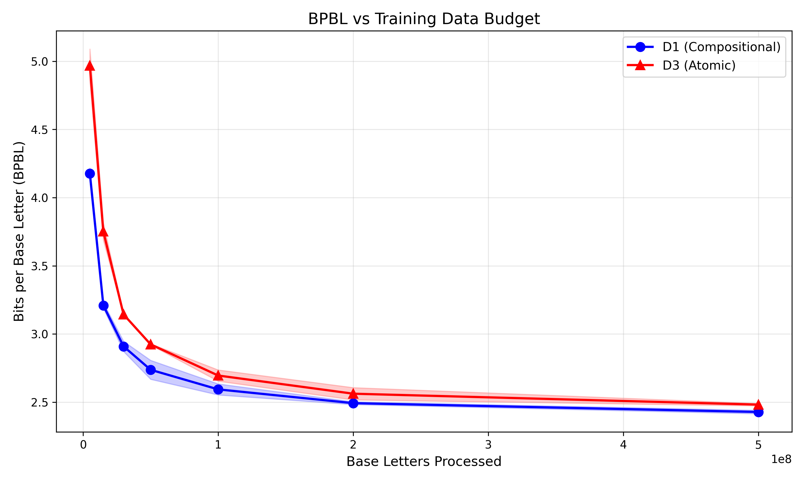

# The Compositionality-Atomicity Tradeoff

**How Tokenization Design Shapes Embedding Structure in Language Models**

We show that "perfect" tokenization can produce worse language models — and explain why mechanistically.

Using Arabic diacritical marks (harakat) as a controlled test case, we compare three encoding strategies on the same corpus and find that atomic tokenization destroys compositional structure in the embedding layer. The model treats diacritical variants of the same letter as unrelated tokens (cosine similarity = 0.125, near-random), forcing it to learn relationships from scratch rather than inheriting them from shared subword structure.

<p align="center">
  
</p>

## Key Findings

| Finding | Detail |
|---------|--------|
| **Compositionality-atomicity tradeoff** | Atomic tokens eliminate fragmentation but destroy compositional sharing in embeddings |
| **Ordering: D1 < D3 < D2** | Standard diacritized BPE beats atomic encoding, which beats stripped text |
| **Data-scale dependent** | The D1-vs-D3 gap shrinks from 25% at 5M base letters to 1.7% at 500M |
| **Embedding structure** | D3 intra-group cosine similarity = 0.125 (near-random); D1 harakah cluster at 0.224 |
| **BPBL metric** | Bits Per Base Letter — a tokenizer-fair metric that removes the fertility confound |

## Three Encoding Strategies

| Condition | Strategy | Description |
|-----------|----------|-------------|
| **D1** | Compositional | Raw diacritized text, standard BPE. Harakah are combining characters. |
| **D2** | Lossy | Diacritics stripped entirely. What every Arabic LLM does today. |
| **D3** | Atomic | Each letter+diacritic pair mapped to a single unique token (PUA codepoints). |

## Reproduce

**Requirements**: Apple Silicon Mac, Python 3.10+, [uv](https://docs.astral.sh/uv/)

```bash
# Clone and install
git clone https://github.com/ahmadalzaro1/autoresearch-arabic.git
cd autoresearch-arabic
uv sync

# Prepare data (downloads from HuggingFace, builds D1/D2/D3 shards)
uv run build_dataset.py
uv run prepare.py

# Train a single model
uv run train.py

# Run experiments
uv run experiments/iso_data_scaling.py     # Iso-data scaling curves
uv run experiments/bpbl_evaluation.py     # BPBL metric (10 seeds)
uv run experiments/embedding_analysis.py  # Embedding analysis
```

## Project Structure

```
train.py                    # GPT training loop (MLX)
prepare.py                  # Tokenizer + data shard preparation
build_dataset.py            # D1/D2/D3 encoding pipeline
validate_dataset.py         # Dataset integrity checks
extract_best.py             # Extract best config from search results

experiments/
  bpbl_evaluation.py        # BPBL metric with 10-seed robust eval
  embedding_analysis.py     # Embedding cosine similarity analysis
  iso_data_scaling.py       # Iso-data scaling curves (D1 vs D3)
  architecture_control.py   # Architecture confound control
  results/                  # JSONs + PNGs (committed)
    iso_data_results.json
    bpbl_results_robust.json
    *.png                   # Figures

paper/latex/
  main.tex                  # ACL-format paper
  main.pdf                  # Compiled PDF
  references.bib
  generate_figures.py       # Reproduce all figures
  figures/                  # Publication figures (PDF)

tests/                      # pytest suite
```

## Dataset

We use the [arabic-tashkeel-dataset](https://huggingface.co/datasets/Abdou/arabic-tashkeel-dataset) (MIT license) — 1.5M examples of fully vocalized classical Arabic text from the Tashkeela corpus.

The dataset is **not included** in this repo. Running `build_dataset.py` downloads it automatically from HuggingFace.

## Built With

- [MLX](https://github.com/ml-explore/mlx) — Apple Silicon ML framework
- [autoresearch-mlx](https://github.com/trevin-creator/autoresearch-mlx) — Karpathy's autoresearch ported to MLX
- 200+ training runs on a single Mac

## Citation

```bibtex
@article{alzaro2026compositionality,
  title={The Compositionality--Atomicity Tradeoff: How Tokenization Design Shapes Embedding Structure in Language Models},
  author={Al-Zaro, Ahmad},
  year={2026}
}
```

## License

MIT
